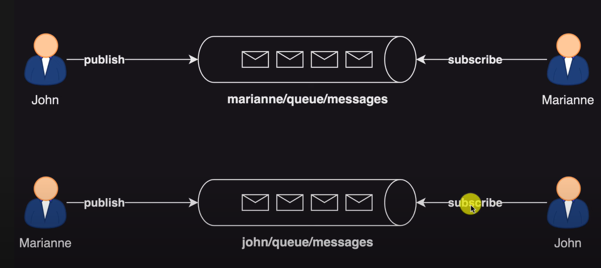
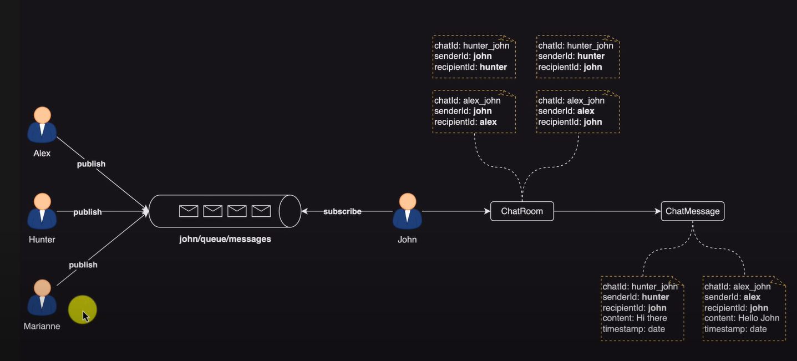
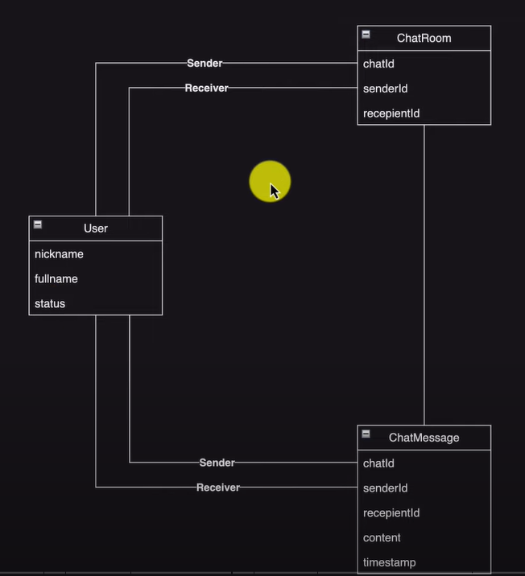

## Note

 - say, John... he should be subscribed to his own queue

 - We need to persist the communication
   - We need  chat room
     - Look at the chat ID
       - e.g. alex_john :: to mean that the chat is between alex and john

 - Structure

 - nickname should be unique

// continue ... chatRoom